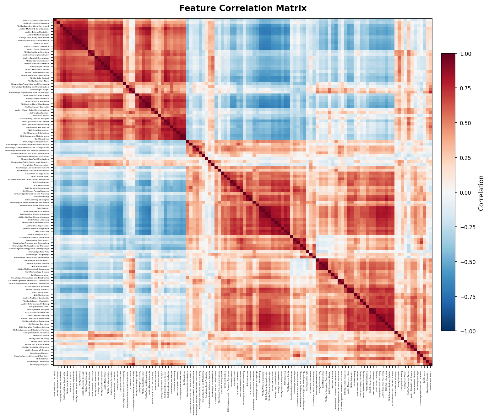
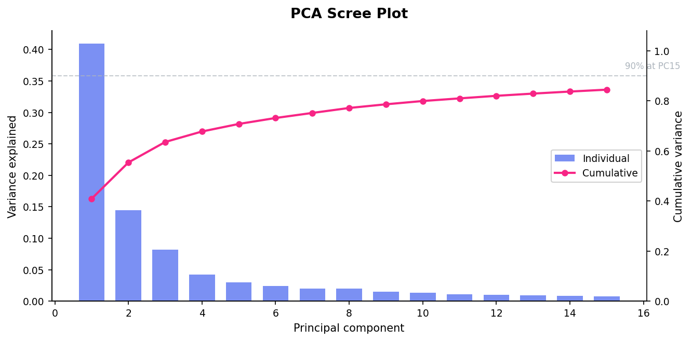
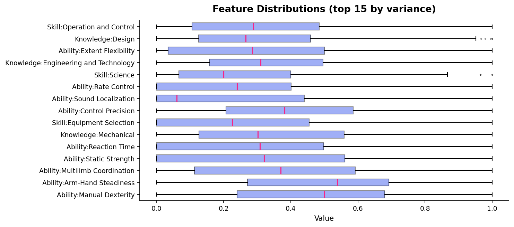
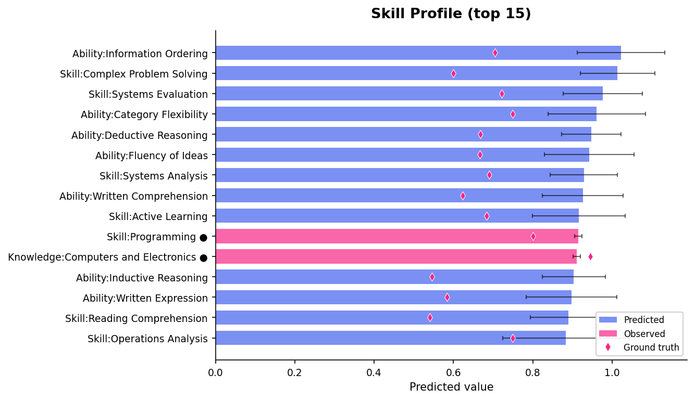
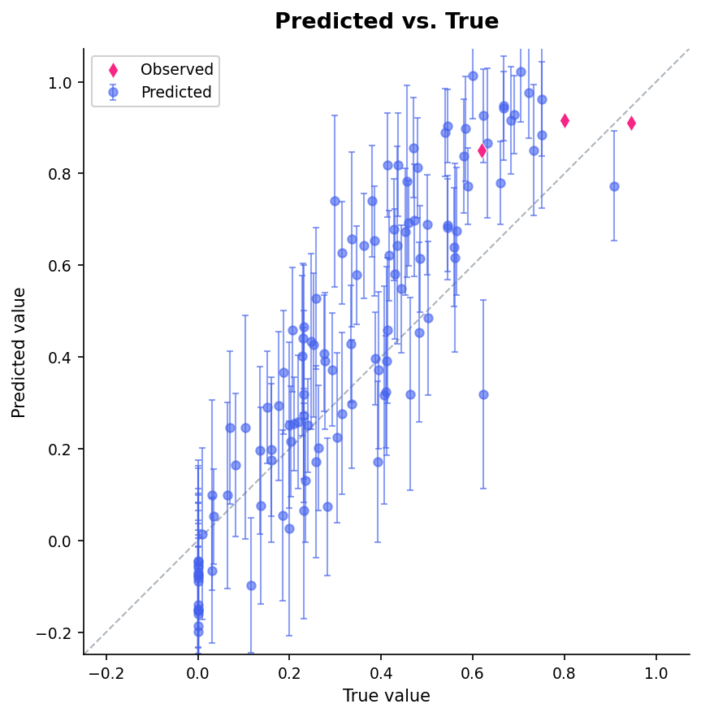
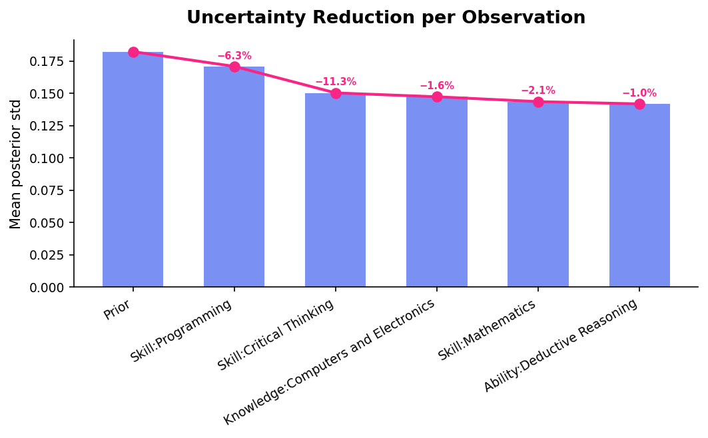
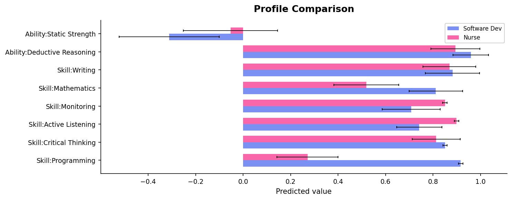
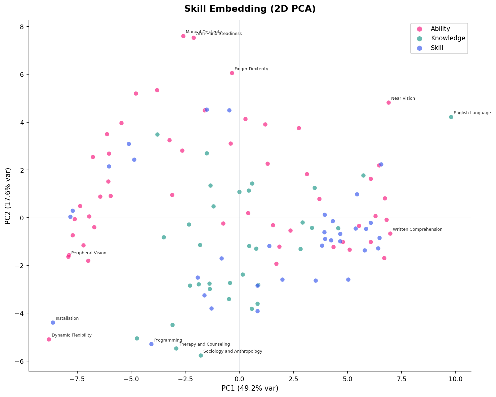
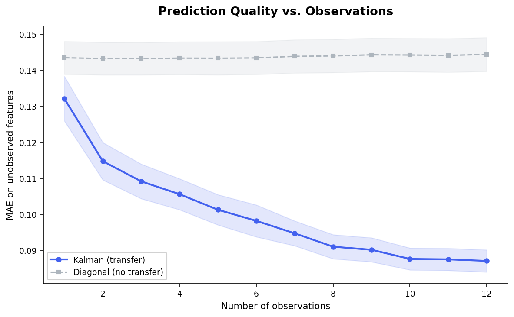

# Visualization

Plotting utilities for exploring populations and skill profiles. Requires `matplotlib`:

```bash
pip install skillinfer[viz]
```

All functions return a matplotlib `Figure` and accept an optional `ax` parameter for composing plots.

---

## Population Charts

### `correlation_heatmap`

```python
skillinfer.visualization.correlation_heatmap(pop, cluster=True, figsize=(11, 9), ax=None) -> Figure
```

Clustered correlation heatmap. Ward's method groups correlated features into blocks along the diagonal.

```python
import skillinfer

pop = skillinfer.datasets.onet()
fig = skillinfer.visualization.correlation_heatmap(pop)
```



The two red blocks are the cognitive cluster (top-left) and physical/manual cluster (bottom-right). Blue off-diagonal regions show anti-correlation — high cognitive skills predict low physical skills.

---

### `scree_plot`

```python
skillinfer.visualization.scree_plot(pop, max_components=30, ax=None) -> Figure
```

PCA variance explained with a 90% threshold marker. Shows the effective dimensionality of the feature space.

```python
fig = skillinfer.visualization.scree_plot(pop, max_components=15)
```



PC1 alone explains 41% of variance (the cognitive vs. physical axis). The 90% line at PC15 means 120 features compress into ~15 effective dimensions — strong structure for covariance transfer.

---

### `feature_distributions`

```python
skillinfer.visualization.feature_distributions(pop, top_k=20, ax=None) -> Figure
```

Box plots showing how the top-k highest-variance features are distributed across entities. Reveals which features differentiate entities the most.

```python
fig = skillinfer.visualization.feature_distributions(pop, top_k=15)
```



Physical abilities (Manual Dexterity, Static Strength) have the widest spread — occupations vary most on these. Skills like Programming and Science are bimodal (most occupations score low, technical ones score high).

---

## Profile Charts

### `posterior_profile`

```python
skillinfer.visualization.posterior_profile(profile, reference=None, top_k=20, ax=None) -> Figure
```

Horizontal bar chart of predicted skills with uncertainty. Observed features are highlighted in pink. Pass a ground truth vector as `reference` to overlay red diamonds.

```python
profile = pop.profile()
profile.observe("Skill:Programming", 0.92)
profile.observe("Skill:Critical Thinking", 0.85)
profile.observe("Knowledge:Computers and Electronics", 0.91)

true_vec = pop.entity("Software Developers")
fig = skillinfer.visualization.posterior_profile(profile, reference=true_vec, top_k=15)
```



Blue bars are predicted, pink bars are observed (marked with ●). Error bars show posterior uncertainty. Red diamonds are ground truth — from 3 observations, the model correctly ranks the top skills.

---

### `prediction_scatter`

```python
skillinfer.visualization.prediction_scatter(profile, true_vector, ax=None) -> Figure
```

Scatter plot of predicted vs. true values for all features. Points on the diagonal are perfect predictions. Error bars show uncertainty — wider bars mean less confident predictions.

```python
fig = skillinfer.visualization.prediction_scatter(profile, true_vec)
```



Observed features (pink diamonds) sit exactly on the diagonal. Predicted features (blue) cluster around the diagonal with error bars that generally contain the true value. Outliers far from the diagonal are where more observations would help.

---

### `uncertainty_waterfall`

```python
skillinfer.visualization.uncertainty_waterfall(pop, observations, ax=None) -> Figure
```

Shows how average uncertainty decreases with each sequential observation. Reveals diminishing returns — the first few observations reduce uncertainty the most.

```python
fig = skillinfer.visualization.uncertainty_waterfall(pop, {
    "Skill:Programming": 0.92,
    "Skill:Critical Thinking": 0.85,
    "Knowledge:Computers and Electronics": 0.91,
    "Skill:Mathematics": 0.80,
    "Ability:Deductive Reasoning": 0.75,
})
```



The first two observations (Programming, Critical Thinking) reduce uncertainty by 17.6%. Each subsequent observation has smaller impact — useful for deciding when to stop evaluating.

---

### `compare_profiles`

```python
skillinfer.visualization.compare_profiles(profiles, features=None, top_k=10, ax=None) -> Figure
```

Side-by-side comparison of multiple profiles on selected features. If `features` is not given, automatically picks the features where profiles differ most.

```python
dev = pop.profile().observe_many({"Skill:Programming": 0.92, "Skill:Critical Thinking": 0.85})
nurse = pop.profile().observe_many({"Skill:Active Listening": 0.90, "Skill:Monitoring": 0.85})

fig = skillinfer.visualization.compare_profiles(
    {"Software Dev": dev, "Nurse": nurse},
    features=["Skill:Programming", "Skill:Critical Thinking", "Skill:Active Listening",
              "Skill:Monitoring", "Skill:Mathematics", "Skill:Writing",
              "Ability:Deductive Reasoning", "Ability:Static Strength"],
)
```



The software developer profile dominates on Programming and Deductive Reasoning; the nurse profile is stronger on Active Listening and Monitoring. Both share high Critical Thinking. Error bars show where we're less certain — wider bars mean that skill was inferred, not observed.

---

### `skill_embedding`

```python
skillinfer.visualization.skill_embedding(pop, ax=None) -> Figure
```

2D PCA projection of features, colored by category (`Skill`, `Knowledge`, `Ability`). Each point is a feature — nearby features are correlated, distant features are independent or anti-correlated. PC1 is typically the cognitive vs. physical axis.

```python
fig = skillinfer.visualization.skill_embedding(pop)
```



Physical abilities (Manual Dexterity, Dynamic Flexibility) cluster at top-left; cognitive skills (Written Comprehension, English Language) cluster at bottom-right. Programming sits at the bottom — highly cognitive but distinct from verbal skills on PC2.

---

### `convergence_curve`

```python
skillinfer.visualization.convergence_curve(pop, n_entities=20, max_observations=None, seed=42, ax=None) -> Figure
```

Prediction quality (MAE) vs. number of observations. Holds out entities, observes 1, 2, 3, ... features, and compares Kalman (full covariance transfer) against the diagonal baseline (no transfer). Answers the question: **how many observations do I need?**

```python
fig = skillinfer.visualization.convergence_curve(pop, n_entities=30, max_observations=12)
```



The Kalman filter (blue) starts better than the diagonal baseline (grey) and improves steadily with each observation. The diagonal baseline barely improves — without covariance transfer, observing one feature tells you nothing about the others. The gap is the value of transfer.

---

## Composing plots

All functions accept an `ax` parameter:

```python
import matplotlib.pyplot as plt

fig, axes = plt.subplots(1, 2, figsize=(16, 6))
skillinfer.visualization.scree_plot(pop, ax=axes[0])
skillinfer.visualization.posterior_profile(profile, ax=axes[1])
fig.tight_layout()
```
